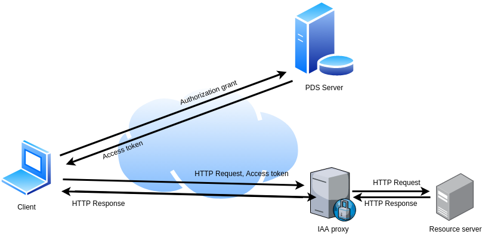

# Identity, Authentication, and Authorization Component
## Description
This is the Identity, Authentication, and Authorization (IAA) Component of the SOFIE framework.

This component implements an HTTP forward proxy that performs user authorization based on an access token. It supports the following types of access tokens:
Decentralized Identifiers, Verifiable Credentials, and JSON web tokens. 

### Architecture Overview
As shown in Figure 1, the IAA components intercepts the communication between a 
client and a resource server. The resource server may not be accessible over the
Internet. The client needs to obtain a valid access token (e.g., using SOFIE's
PDS component). Then, the client performs an HTTP request by including the obtained
token in an HTTP Authentication header. Based on the type of the token, and IAA's
configured policies, IAA may reject the request, may forward it to the resource
server, or it may respond with a ``challenge'' that the client must sign in order
to prove the s/he is the legitimate owner of the access token. 

Figure 1: The IAA component

### Relation with SOFIE

More information about this component and its relation to the SOFIE project can be found in [D2.5 Federation Framework, SOFIE deliverable](https://media.voog.com/0000/0042/0957/files/SOFIE_D2.5-Federation_Framework%2C_2nd_version.pdf)

### Key Technologies

The software modules are implemented in Python 3. Currently the component supports
Hyperledger Indy DID and VC, W3C VC, JWT, and JWT backed by Ethereum ERC-721 tokens
(as described in [N. Fotiou et al. "OAuth 2.0 authorization using blockchain-based
tokens", in proc of the NDSS DISS workshop, 2020](https://www.ndss-symposium.org/wp-content/uploads/2020/04/diss2020-23002-paper.pdf))

## Usage

## Installation

### Prerequisites
IAA component is built using Python3. It depends on the following packages:

* pip3 install Werkzeug
* pip3 install pynacl 
* pip3 install jsonpath-ng

Depending on the type of access tokens that will be used the following additional dependencies are required

#### JWT
* pip3 install pyjwt

#### JWT backed by ERC-721 token
* pip3 install jsonpath-ng
* pip3 install jpyjwt
* pip3 install web3

#### W3C-VC
* pip3 install PyLD

#### Hyperlink Indy DID/VC
* sudo apt-key adv --keyserver keyserver.ubuntu.com --recv-keys CE7709D068DB5E88
* sudo add-apt-repository "deb https://repo.sovrin.org/sdk/deb bionic stable"
* sudo apt-get update
* sudo apt-get install -y libindy
* pip3 install python3-indy

The following commands perform a full installation of IAA

* sudo apt-key adv --keyserver keyserver.ubuntu.com --recv-keys CE7709D068DB5E88
* sudo add-apt-repository "deb https://repo.sovrin.org/sdk/deb bionic stable"
* sudo apt-get update
* sudo apt-get install -y libindy
* pip3 install python3-indy pyjwt web3 
* pip3 install Werkzeug
* pip3 install pynacl 
* pip3 install PyLD
* pip3 install jsonpath-ng

### Configuration
The core configuration file of the component is `conf/iaa.conf`. There the protected resources are described. 
The file contains a mapping from resource relative URIs to authentication and proxy configurations.
The authentication entry of a resource contains the following fields:

| Field | Possible values |
| --- | --- |
| type | "jwt", "jwt-erc721", "w3c-vc", "indy-did", "indy-vc" |
| tokens_expire | true, false (optional, used only with type "jwt") |
| signing_key_file | A path to the key used for signing a JWT |
| filters | A list of json-path queries |

The proxy entry of a resource contains the following fields:

| Field | Possible values |
| --- | --- |
| proxy_pass | The base URI of the resource |
| header_rewrite | A list of headers that will be included in the forwarded request |

### Execution from source
From the root directory run `python3 IAA/iaa.py <configuration file>` e.g., `python3 IAA/iaa.py conf/iaa.conf`

### Dockerized version
In order to build IAA image, execute the script `docker-build.sh`. Then you can run IAA using, for example,  `docker run -tid --rm -p 9000:9000 iaa`. You can verify that IAA is running properly be executing the script `examples/validate_token.sh`

### Usage

#### Example
See [here](https://github.com/SOFIE-project/PDS-IAA) for usage examples. 

## Testing

### Prerequisites
Tests are executed using pytest and pytest-asyncio. To install it execute: 

* pip3 install -U pytest 
* pip3 install pytest-asyncio

### Running the tests
From the root directory run `python3 -m pytest -s  tests/` For shorter output alternatively you can run `python3 -m pytest tests/ -s --tb=short`

## Integration

To be provided.

## Deployment

To be provided.

## Known/Open Issues

No known issues

## Contact info

Please contact Nikos Fotiou or Iakovos Pittaras (AUEB) in case of any questions.

***